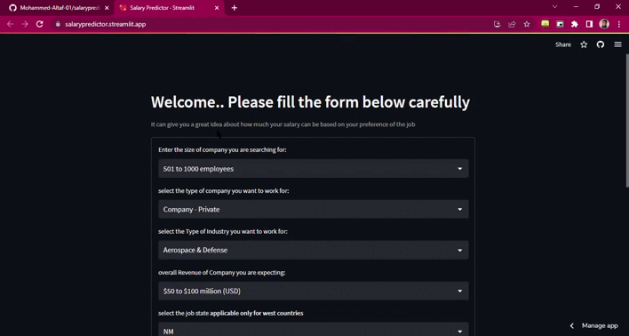
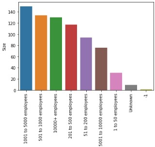
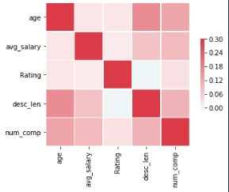
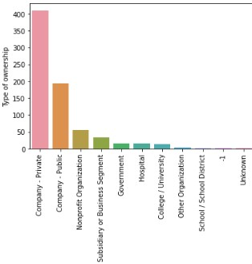
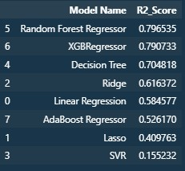

# Salary Estimator: Project Overview

- Created a tool that estimates data science salaries (MAE ~ $ 17-18K) to help data scientists negotiate their income when they get a job.
- Scraped over 1000 job descriptions from glassdoor using python and selenium
- Engineered features from the text of each job description to quantify the value companies put on python, excel, aws, and spark.
- Optimized Linear, Lasso, and Random Forest Regressors using GridsearchCV to reach the best model.
- Built a Web application using Streamlit and deployed it on Streamlit Cloud <a href="https://salarypredictor.streamlit.app/">Acess the app here</a>

# Resources Used

**Python Version:** 3.10
**Packages:** pandas, numpy, sklearn, matplotlib, seaborn, selenium, streamlit, json, pickle,xgboost  
**For Web Framework Requirements:** `pip install -r requirements.txt`  
**Scraper Github:** https://github.com/arapfaik/scraping-glassdoor-selenium

# QuickStart Demo

---

# Web Scraping

Tweaked the web scraper github repo (above) to scrape 1000 job postings from glassdoor.com. With each job, we got the following:

- Job title
- Salary Estimate
- Job Description
- Rating
- Company
- Location
- Company Headquarters
- Company Size
- Company Founded Date
- Type of Ownership
- Industry
- Sector
- Revenue
- Competitors

# Data Cleaning

After scraping the data, I needed to clean it up so that it was usable for our model. I made the following changes and created the following variables:

- Parsed numeric data out of salary
- Made columns for employer provided salary and hourly wages
- Removed rows without salary
- Parsed rating out of company text
- Made a new column for company state
- Added a column for if the job was at the company’s headquarters
- Transformed founded date into age of company
- Made columns for if different skills were listed in the job description:
  - Python
  - Excel
  - AWS
  - Spark
- Column for simplified job title and Seniority
- Column for description length

# EDA

Most of the features are not correlated, that is a good sign and would help in the actual prediction.

Companies hiring count based on there employees Size in there company

 

 

---

**Below is the r2 score of various models that were tested.**

# Model Building

First converted the Categorical Features into numerical and scaled all the values, saved a pipeline for further used as an endpoint for the frontend. Then Experimented with various models such as **Xg regressor, Randomforest Regressor, Ridge and Lasso Regressor, Decision Tree regressor and have also tried an Stacking Ensemble with top 5 performing models** But due to improper results it was avoided and Xg boost is used in the end, which was giving out the best results.

# License

[(Back to top)](#table-of-contents)

This is a personal project I have made using the modularized code and productionized it as a RESTFUL api instead of using the jupyter notebooks, anyonce can use this freely without any restrictions, but don't forget to tag 😊
